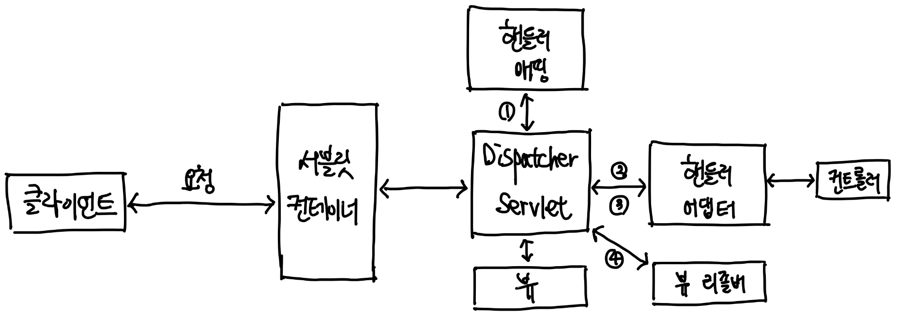
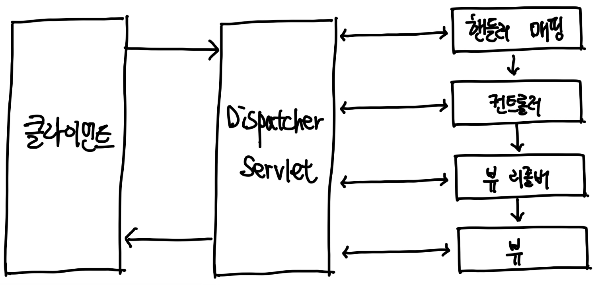
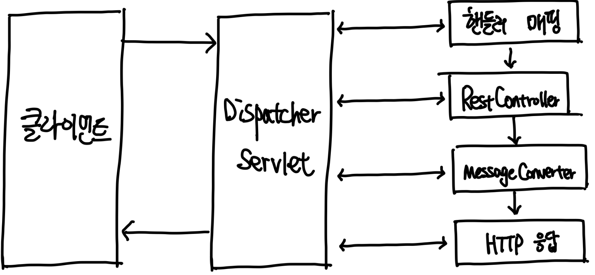
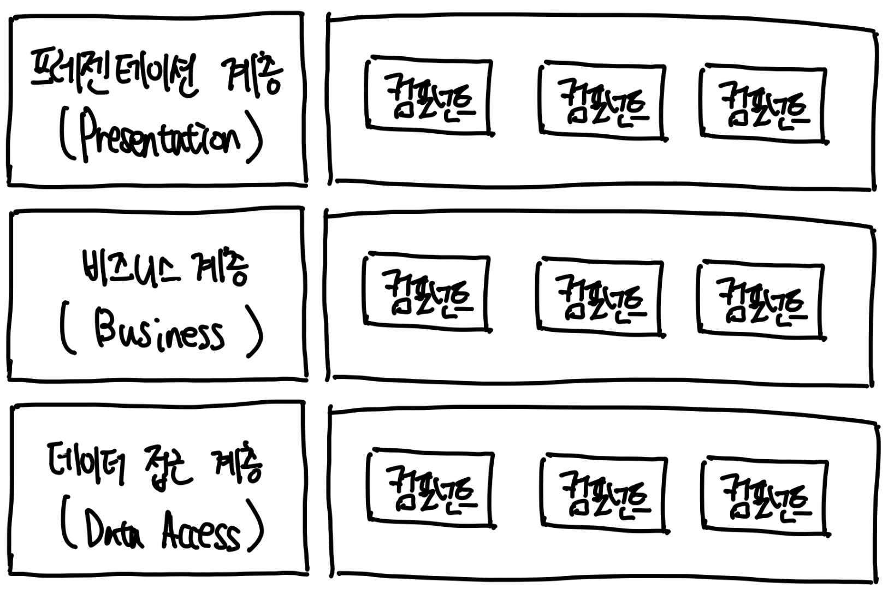
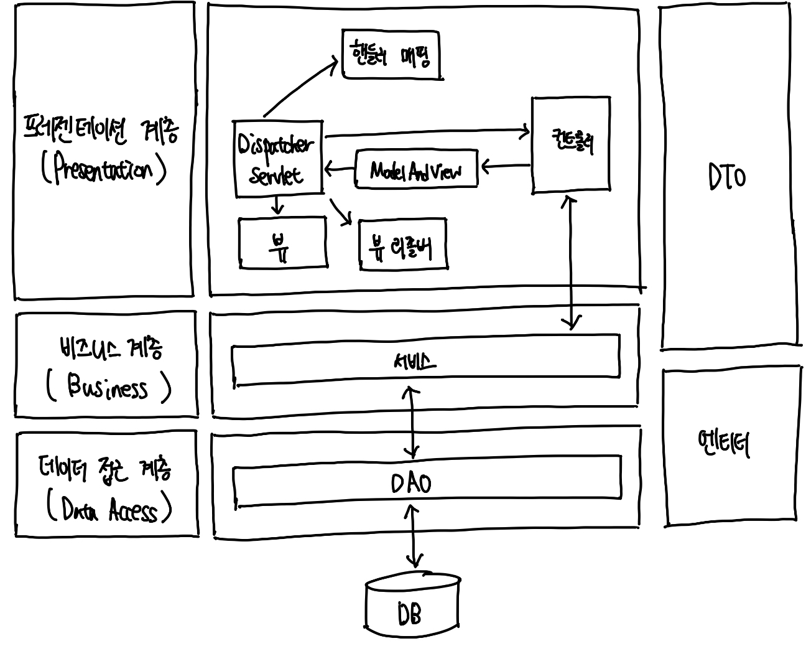

# 개발에 앞서 알면 좋은 기초 지식 

애플리케이션이 어떻게 동작하는지, 왜 이렇게 구성되는지 생각하며 실습하기 위한 개발 배경지식 

## 서버 간 통신 

마이크로서비스 아키텍처(MSA) 
- 서비스 규모를 작게 나누어 구성한 아키텍처 
- 애플리케이션을 기능별로 나눠서 개발 
- 이렇게 애플리케이션을 개발하면 각 서비스 간에 통신해야 하는 경우가 발생 

서버 간 통신은 한 서버가 다른 서버에 통신을 요청하는 것을 의미 
- 한 대는 서버, 다른 한 대는 클라이언트가 되는 구조 
- 몇 가지 프로토콜에 의해 다양한 통신 방식을 적용 가능, 가장 많이 사용되는 방식은 HTTP/HTTPS 방식 

## 스프링 부트의 동작 방식 

스프링 부트에서 spring-boot-starter-web 모듈을 사용하면 기본적으로 톰캣(Tomcat)을 사용하는 스프링 MVC 구조를 기반으로 동작 

- 위 그림은 일반적인 웹 요청이 들어왔을 때의 스프링 부트의 동작 구조 
- 서블릿(Servlet)은 클라이언트을 처리하고 결과를 반환하는 자바 웹 프로그래밍 기술 
  - 일반적으로 서블릿은 서블릿 컨테이너에서 관리 
  - 서블릿 컨테이너는 서블릿 인스턴스(Servlet Instance)를 생성하고 관리하는 역할을 수행하는 주체, **Tomcat은 WAS의 역할과 서블릿 컨테이너의 역할을 수행하는 대표적인 컨테이너**, 서블릿 컨테이너의 특징은 다음과 같다.  
    - 서블릿 객체를 생성, 초기화, 호출, 종료하는 생명주기를 관리 
    - 서블릿 객체는 싱글톤 패턴으로 관리 
    - 멀티 스레딩을 지원
- 스프링에서는 DispatcherServlet이 서블릿의 역할을 수행한다. DispatcherServlet의 동작은 다음과 같다. 
  > 1. DispatcherServlet으로 요청(HttpServletRequest)이 들어오면 DispatcherServlet은 핸들러 매핑(Handler Mapping)을 통해 요청 URL에 매핑된 핸들러를 탐색 
  >   - 여기서의 핸들러는 Controller를 의미 
  > 2. 핸들러 어댑터(HandlerAdapter)로 컨트롤러를 호출한다. 
  > 3. 핸들러 어댑터에 컨트롤러의 응답이 돌아오면 ModelAndView로 응답을 가공해 반환한다. 
  > 4. 뷰 형식으로 리턴하는 컨트롤러를 사용할 때는 뷰 리졸버(View Resolver)를 통해 뷰(View)를 받아 리턴한다.

- 핸들러 매핑은 요청 정보를 기준으로 어떤 컨트롤러를 사용할지 선정하는 인터페이스이다. 핸들러 매핑 인터페이스는 여러 구현체를 가지며, 대표적인 구현체 클래스는 다음과 같다. 
  - BeanNameUrlHandlerMapping 
    - Bean 이름을 URL로 사용하는 매핑 전략 
    - Bean을 정의할 때 / 가 들어가면 매핑 대상이 됨
    - ex. @Bean("/hello")
  - ControllerClassNameHandlerMapping 
    - URL과 일치하는 클래스 이름을 갖는 Bean을 Controller로 사용하는 전략 
    - 이름 중 Controller를 제외하고 앞부분에 작성된 suffix를 소문자로 매핑 
  - SimpleUrlHandlerMapping 
    - URL 패턴에 매핑된 Controller를 사용하는 전략 
  - DefaultAnnotationHandlerMapping 
    - 어노테이션으로 URL과 Controller를 매핑하는 방법 

- 일반적으로 스프링은 톰캣을 임베디드해 사용한다. 
  - 따라서, 서블릿 컨테이너와 DispatcherServlet은 자동 설정된 web.xml의 설정값을 공유

- 뷰 리졸버는 뷰의 랜더링 역할을 담당하는 뷰 객체를 반환 

- 뷰가 없는 REST 형식의 @ResponseBody를 사용할 예정 
- 뷰 리졸버를 호출하지 않고 MessageConverter를 거쳐 JSON 형식으로 변환해서 응답 
  - MessageConverter는 요청과 응답에 대해 Body 값을 변환하는 역할을 수행
- 스프링 부트의 자동 설정 내역을 보면 HttpMessageConverter 인터페이스를 사용 

## 레이어드 아키텍처 

레이어드 아키텍처란 애플리케이션의 컴포넌트를 유사 관심사를 기준으로 레이어로 묶어 수평적으로 구성한 구조 
- 레이어드 아키텍처는 여러 방면에서 쓰이는 개념, 어떻게 설계하느냐에 따라 용어와 계층 수가 달라짐 

일반적인 레이어드 아키텍처는 3계층 혹은 4계층 구성을 의미 (이 차이는 인프라(데이터베이스) 레이어의 추가 여부로 결정) 

- **프레젠테이션 계층**
  - 애플리케이션의 최상단 계층으로 클라이언트의 요청을 해석하고 응답하는 역할 
  - UI나 API 제공 
  - 프레젠테이션 계층은 별도의 비즈니스 로직을 포함하고 있지 않으므로 비즈니스 계층으로 요청을 위임하고 받은 결과를 응답하는 역할만 수행 
- **비즈니스 계층** 
  - 애플리케이션이 제공하는 기능을 정의하고 세부 작업을 수행하는 도메인 객체를 통해 업무를 위임하는 역할을 수행 
  - DDD(Domain-Driven Design) 기반의 아키텍처에서는 비즈니스 로직에 도메인이 포함되기도 하고, 별도로 도메인 계층을 두기도 함 
- **데이터 접근 계층** 
  - 데이터베이스에 접근하는 일련의 작업을 수행 

 

레이어드 아키텍처는 하나의 애플리케이션에도 적용되지만 애플리케이션 간의 관계를 설명하는 데도 사용할 수 있음. 레이어드 아키텍처 기반 설계는 다음과 같은 특징을 가짐. 
- 각 레이어는 가장 가까운 하위 레이어의 의존성을 주입받음 
- 각 레이어는 관심사에 따라 묶여 있으며, 다른 레이어의 역할을 침범하지 않음 
  - 각 컴포넌트의 역할이 명확하므로 코드의 가독성과 기능 구현에 유리 
  - 코드의 확장성이 좋아짐 
- 각 레이어가 독립적으로 작성되면 다른 레이어와의 의존성을 낮춰 단위 테스트에 용이 

> 스프링 부트는 별도의 설정 없이 spring-boot-starter-web의 의존성을 사용할 때는 기본적으로 **스프링 MVC 구조**를 띠게 되며, 대체로 다음과 같은 아키텍처를 이룬다. 

- 레이어드 아키텍처를 스프링에 적용한 모습 
- Spring MVC는 Model-View-Controller의 구조로 **View와 Controller는 프레젠테이션 계층** 영역이며, **Model은 비즈니스와 데이터 접근 계층의 영역**으로 구분 가능 
  - 다만 스프링 MVC모델로 레이어드 아키텍처를 구현하기 위해서는 역할을 세분화함 
- 비즈니스 계층에 서비스를 배치해 엔티티와 같은 도메인 객체의 비즈니스 로직을 조합
- 데이터 접근 계층에는 DAO(Spring Data JPA에서는 Repository)를 배치해 도메인을 관리 

다음은 스프링 레이어드 아키텍처이다. 
- 프레젠테이션 계층
  - 상황에 따라 유저 인터페이스(UI, User Interface) 계층이라고도 함 
  - 클라이언트와의 접점 
  - 클라이언트로부터 데이터와 함께 요청을 받고 처리 결과를 응답으로 전달하는 역할 
- 비즈니스 계층 
  - 상황에 따라 서비스(Service) 계층이라고도 함 
  - 핵심 비즈니스 로직을 구현하는 영역 
  - 트랜잭션 처리나 유효성 검사 등의 작업도 수행 
- 데이터 접근 계층 
  - 상황에 따라 영속(Persistence) 계층이라고도 함 
  - 데이터베이스에 접근해야 하는 작업을 수행 
  - DAO는 Spring Data JPA에서는 DAO 역할을 레포지토리가 수행하므로 레포지토리로 대체 가능 

> 레이어드 아키텍처는 일반적인 계층 구조를 기반으로 필요에 따라 조금씩 변형해서 사용한다. 가장 중요한 부분은 비즈니스 계층 영역, 비즈니스 로직을 어디서 담당할지 결정하고 설계하는 것이 좋다. 
> 비즈니스 로직은 도메인 계층에서 담당하는 것이 일반적이다. 
> 
> 스프링에서 JPA를 사용하면 @Entity를 정의한 클래스가 도메인 객체가 되며, 이곳에서 비즈니스 로직을 설계하면 좋다. 다만 서비스 레이어에서 비즈니스 로직을 담당하는 경우도 있으므로 이러한 역할과 책임을 잘 구분해서 설계해야 한다. 

## 디자인 패턴 

디자인 패턴은 소프트웨어를 설계할 때 자주 발생하는 문제들을 해결하기 위해 고안된 해결책이다. 디자인 패턴에서 패턴은 애플리케이션 개발에서 발생하는 문제는 유사한 경우가 많고 해결책도 동일하게 적용할 수 있다는 의미를 내포한다. 

> 디자인 패턴이 모든 문제에 정답은 아니며, 상황에 맞는 최적 패턴을 결정해서 사용하는 것이 바람직하다. 

### 디자인 패턴 종류 

디자인 패턴을 구체화해서 정리한 대표적인 분류 방식으로 **GoF 디자인 패턴**이 있다.
- GoF는 Gang of Four의 줄임말로 디자인 패턴을 구체화하고 체계화해서 분류한 4명의 인물을 의미

| 생성(Creational) 패턴         | 구조(Structural) 패턴 | 행위(Behavioral) 패턴               |
|---------------------------|-------------------|---------------------------------|
| 추상 팩토리 (Abstract Factory) | 어댑터 (Adapter)     | 책임 연쇄 (Chain of Responsibility) |
| 빌더 (Builder)              | 브리지 (Bridge)      | 커맨드 (Command)                   | 
| 팩토리 메서드 (Factory Method)  | 컴포지트(Composite)   | 인터프리터(Interpreter)              |
| 프로토타입(Prototype)          | 데코레이터(Decorator)  | 이터레이터(Iterator)                 |
| 싱글톤(Singleton)            | 퍼사드(Facade)       | 미디에이터(Mediator)                 |
|                           | 플라이웨이트(Flyweight) | 메멘토(Memento)                    |
|             |프록시 (Proxy)   | 옵저버 (Observer)                  |
|             |   | 스테이트 (State)                    |
|             | | 스트레티지 (Strategy)                |
|             | | 템플릿 메서드 (Template Method)       |
|             | | 비지터 (Visitor)                   |

GoF 디자인 패턴은 생성 패턴, 구조 패턴, 행위 패턴 3가지로 구분됨 
- 생성 패턴 
  - 객체 생성에 사용되는 패턴으로, 객체를 수정해도 호출부가 영향을 받지 않게 함 
- 구조 패턴 
  - 객체를 조합해서 더 근 구조를 만드는 패턴 
- 행위 패턴 
  - 객체 간의 알고리즘이나 책임 분배에 관한 패턴 
  - 객체 하나로는 수행할 수 없는 작업을 여러 객체를 이용해 작업을 분배 
    - 결합도 최소화를 고려할 필요가 있음 

### 생성 패턴 

- 추상팩토리 : 구체적인 클래스를 지정하지 않고 상황에 맞는 객체를 생성하기 위한 인터페이스를 제공하는 패턴 
- 빌더 : 객체의 생성과 표현을 분리해 객체를 생성하는 패턴 
- 팩토리 메서드 : 객체 생성을 서브클래스로 분리해서 위임하는 패턴 
- 프로토타입 : 원본 객체를 복사해 객체를 생성하는 패턴 
- 싱글톤 : 한 클래스마다 인스턴스를 하나만 생성해서 인스턴스가 하나임을 보장하고 어느 곳에서도 접근할 수 있게 제공하는 패턴 

### 구조 패턴 

- 어댑터 : 클래스의 인터페이스를 의도하는 인터페이스로 변환하는 패턴 
- 브리지 : 추상화와 구현을 분리해서 각각 독립적으로 변형케 하는 패턴 
- 컴포지트 : 여러 객체로 구성된 복합 객체와 단일 객체를 클라이언트에서 구별 없이 다루는 패턴 
- 데코레이터 : 객체의 결합을 통해 기능을 동적으로 유연하게 확장할 수 있게 해주는 패턴 
- 퍼사드 : 서브시스템의 인터페이스 집합들에 하나의 통합된 인터페이스를 제공하는 패턴 
- 플라이웨이트 : 특정 클래스의 인스턴스 한 개를 가지고 여러 개의 가상 인스턴스를 제공할 때 사용하는 패턴 
- 프록시 : 특정 객체를 직접 참조하지 않고 해당 객체를 대행(proxy)하는 객체를 통해 접근하는 패턴 

### 행위 패턴 

- 책임 연쇄 : 요청 처리 객체를 집합으로 만들어 결합을 느슨하게 만드는 패턴 
- 커맨드 : 실행될 기능을 캡슐화해서 주어진 여러 기능을 실행하도록 클래스를 설계하는 패턴 
- 인터프리터 : 주어진 언어의 문법을 위한 표현 수단을 정의하고 해당 언어로 구성된 문장을 해석하는 패턴 
- 이터레이터 : 내부 구조를 노출하지 않으면서 해당 객체의 집합 원소에 순차적으로 접근하는 방법을 제공하는 패턴 
- 미디에이터 : 한 집합에 속한 객체들의 상호작용을 캡슐화하는 객체를 정의한 패턴 
- 메멘토 : 객체의 상태 정보를 저장하고 필요에 따라 상태를 복원하는 패턴 
- 옵저버 : 객체의 상태 변화를 관찰하는 관찰자들. 즉 옵저버 목록을 객체에 등록해 상태가 변할 때마다 메서드 등을 통해 객체가 직접 옵저버에게 통지하게 하는 디자인 패턴 
- 스테이트 : 상태에 따라 객체가 행동을 변경하게 하는 패턴 
- 스트래티지 : 행동을 클래스로 캡슐화해서 동적으로 행동을 바꿀 수 있게 하는 패턴 
- 템플릿 메서드 : 일정 작업을 처리하는 부분을 서브클래스로 캡슐화해서 전체 수행 구조는 바꾸지 않으면서 특정 단계만 변경해서 수행하는 패턴 
- 비지터 : 실제 로직을 가지고 있는 객체(visitory)가 로직을 적용할 객체(element)를 방문하며 실행하는 패턴 

## REST API 

REST API는 대중적으로 가장 많이 사용되는 애플리케이션 인터페이스. 이 인터페이스를 통해 클라이언트는 서버에 접근하고 자원을 조작 가능 

### REST 란? 

Representational State Transfer의 약자로, 월드 와이드 웹과 같은 분산 하이퍼미디어 시스템 아키텍처의 한 형식. 
- 주고 받은 자원(Resource)에 이름을 규정하고 URI에 명시해 HTTP 메서드(GET, POST, PUT, DELETE)를 통해 해당 자원의 상태를 주고 받는 것을 의미 

### REST API 란? 

API는 Application Programming Interface의 약자로 애플리케이션에서 제공하는 인터페이스를 의미 
- API를 통해 서버 또는 프로그램 사이를 연결할 수 있다. 
- 즉, REST API는 REST 아키텍처를 따르는 시스템/애플리케이션 인터페이스라고 볼 수 있다. 

> REST 아키텍처를 구현하는 웹 서비스를 RESTful하다고 표현 

### REST의 특징 

1. **유니폼 인터페이스** : 일관된 인터페이스를 의미, REST 서버는 HTTP 표준 전송 규약을 따르기 때문에 어떤 프로그래밍 언어로 만들어졌느냐와 상관없이 플랫폼 및 기술에 종속되지 않고 타 언어, 플랫폼, 기술 등과 호환해 사용할 수 있다. 
2. **무상태성** : 무상태성이란 서버에 상태 정보를 따로 보관하거나 관리하지 않는 다는 의미이다. 서버는 클라이언트가 보낸 요청에 대해 세션이나 쿠키 정보를 별도 보관하지 않는다. 그렇기 때문에 한 클라이언트가 여러 요청을 보내든 여러 클라이언트가 각각 하나의 요청을 보내든 개별적으로 처리한다. 이렇게 구성된 서비스는 서버가 불필요한 정보를 관리하지 않으므로 비즈니스 로직의 자유도가 높고 설계가 단순하다.
3. **캐시 가능성** : REST는 HTTP 표준을 그대로 사용하므로 HTTP의 캐시 기능을 적용할 수 있다. 이 기능을 이용하기 위해서는 응답과 요청이 모두 캐싱 가능한지(Cacheable) 명시가 필요하며, 캐싱이 가능한 경우 클라이언트에서 캐시에 저장해두고 같은 요청에 대해서는 해당 데이터를 가져다 사용한다. 이 기능을 사용하면 서버의 트랜잭션 부하가 줄어 효율적이며 사용자 입장에서 성능이 개선된다. 
4. **레이어 시스템** : REST 서버는 네트워크 상의 여러 계층으로 구성될 수 있다. 그러나 서버의 복잡도와 관계없이 클라이언트는 서버와 연결되는 포인트만 알면 된다. 
5. **클라이언트-서버 아키텍처** : REST 서버는 API를 제공하고 클라이언트는 사용자 정보를 관리하는 구조로 분리해 설계한다. 이 구성은 서로에 대한 의존성을 낮추는 기능을 한다.

### REST의 URL 설계 규칙 

- URL의 마지막에는 /를 포함하지 않음 
- _는 사용하지 않음. 대신 -을 사용함 (-은 리소스의 이름이 길어지면 사용)
- URL에는 행위(동사)가 아닌 결과(명사)를 포함 (행위는 HTTP 메서드로 표현)
- URI는 소문자로 작성 
  - URI 리소스 경로에는 대문자 사용을 피하는 것이 좋음 
  - 일부 웹 서버의 운영체제는 리소스 경로 부분의 대소문자를 다른 문자로 인식하기 때문
- 파일의 확장자는 URI에 포함하지 않음 
  - HTTP에서 제공하는 Accept 헤더를 사용하는 것이 좋음
